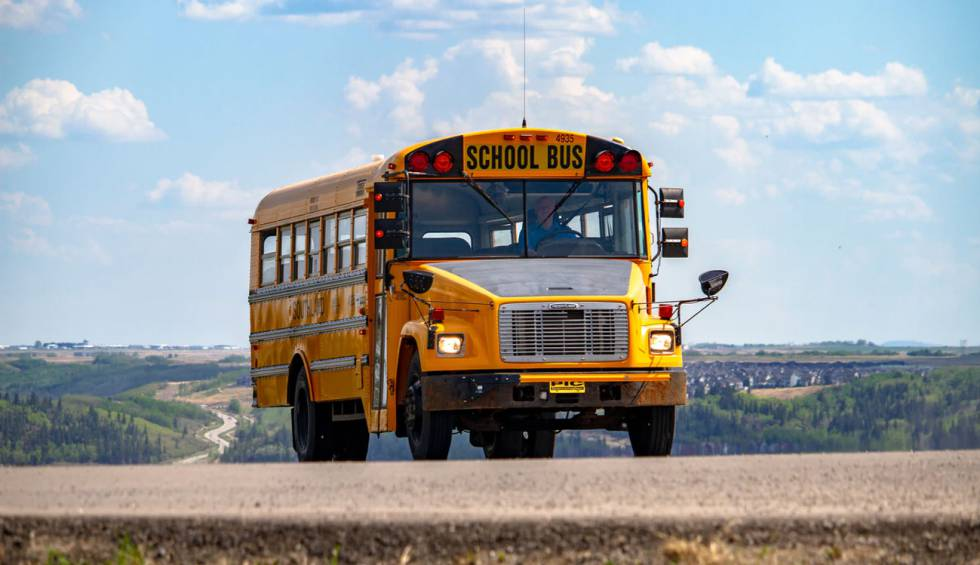

# Reto 3.  El autobús escolar 2

Este reto es muy semejante al anterior solo que en este caso tenemos 2 autobuses y tienen que tiene que salir del TESI, recoger a los alumnos con capacidades diferentes en las colonias de Ixtapaluca, a través de la ruta más corta que pase por todas las colonias de Ixtapaluca. Recuerda que tiene que regresar al TESI al final del recorrido (esta distancia también se cuenta).  

Para esto tienes que genera una lista de colonias en el orden que serán visitadas y asignar el autobús que las visitará.   La carpeta de datos podrás encontrar un archivo con las coordenadas de cada una de las colonias a visitar y del TESI, recuerda que para calcular la distancia es necesario usar la distancia geográfica obtenida por la fórmula del Haversine.

El archivo *“Notebook guía 3“* es notebook de jupyter que ayudará a iniciar el reto.

Sube tu archivo de respuesta al siguiente sitio.
https://forms.gle/uhRBiXq57KUFkZ7p6

## ¡Suerte!
